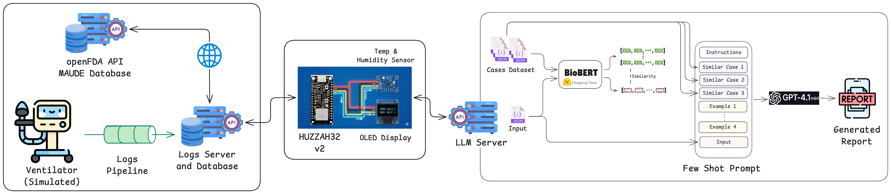
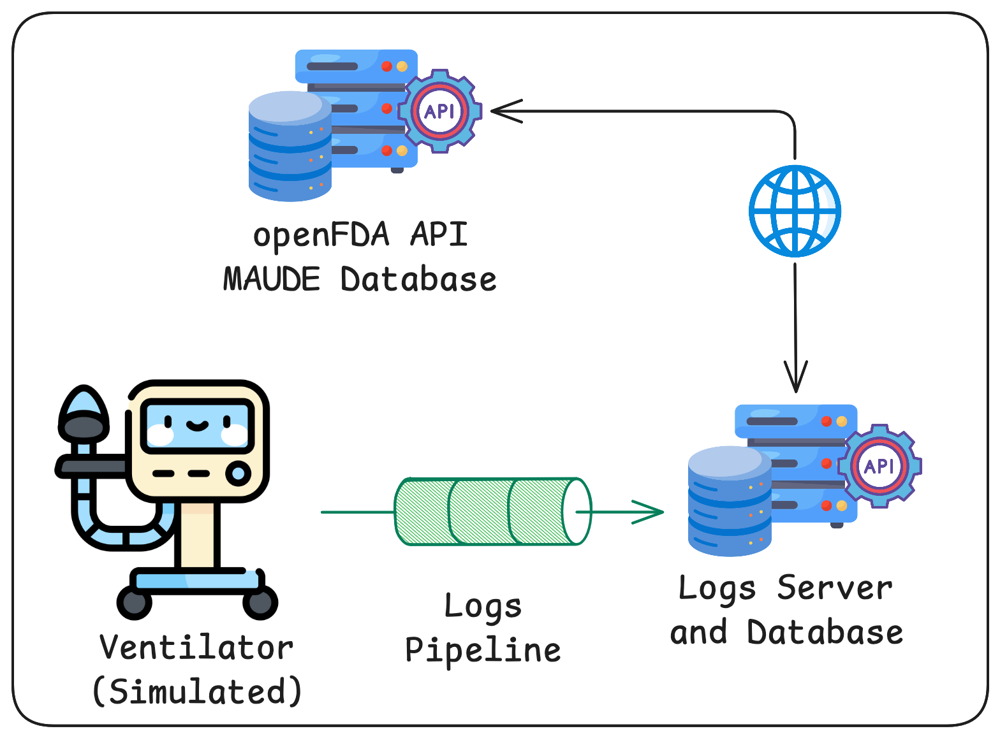

# EECSE-4764 Artificial Intelligence of Things (AIoT) Project <!-- omit from toc -->

This repository contains project implementation for EECSE-4764 Artificial Intelligence of Things (AIoT).

**Semester:** Fall 2025

**Instructor**: Xiaofan (Fred) Jiang

**Team Number:** 9

**Team Members:**

- Junhyung (Richard) Oh - jo2837 ([@ohrjh10](https://github.com/ohrjh10))
- Ying-Shun (Jason) Liao - yl6026 ([@jasonnliao](https://github.com/jasonnliao))
- Pablo Ordorica-Wiener - po2311 ([@pablordoricaw](https://github.com/pablordoricaw))
- Rahul Murugan - rmm2292 ([@rahulmurugan](https://github.com/rahulmurugan))

## Table of Contents <!-- omit from toc -->

- [Project Overview](#project-overview)
- [High-Level System Dataflow Diagram](#high-level-system-dataflow-diagram)
- [Software Dependencies](#software-dependencies)
  - [Shared Dependencies](#shared-dependencies)
    - [Subsystem-Specific Dependencies](#subsystem-specific-dependencies)
- [How to Run Full Project](#how-to-run-full-project)
  - [Manual](#manual)
  - [Automatically](#automatically)
- [Medical Device Subsystem](#medical-device-subsystem)
  - [How to Run](#how-to-run)
- [LLM Server Subsystem](#llm-server-subsystem)
  - [How to Run](#how-to-run-1)
- [MCU Subsystem](#mcu-subsystem)
  - [Components](#components)
    - [Connection Setup](#connection-setup)
    - [Adafruit HUZZAH32 ESP32 V2 Feather Board](#adafruit-huzzah32-esp32-v2-feather-board)
  - [How to Run](#how-to-run-2)

## Project Overview

This project is a complete end‑to‑end prototype of an AI‑powered medical device error triage system designed to support biomedical and clinical engineering teams. It continuously monitors logs generated by medical devices, detects error events, and enriches them with room sensor data and historical incident information derived from FDA MAUDE reports. Using this combined context, a language model generates structured diagnostic reports that explain the likely root cause, suggest troubleshooting steps, and help prioritize which issues need urgent attention.

## High-Level System Dataflow Diagram



## Software Dependencies

For the project there is a single shared `pyproject.toml` file at the repository root to manage dependencies across the three subsystems:

1. Microcontroller code in `mcu/`
2. Medical Device code in `medical_device/`
3. LLM code in `llm/`

> [!NOTE]
> This project uses [uv](https://docs.astral.sh/uv/) for dependency and virtual environment management. Commands below are for `uv`. It is possible to use other dependency and virtual environment management tools, but those are not listed below.
>
> Run these commands from the root project directory (where `pyproject.toml` is located), not from individual subsystem directories.

### Shared Dependencies

Install shared dependencies across the three subsystems with:

```bash
uv sync
```

#### Subsystem-Specific Dependencies

Install the subsystem specific dependencies using:

```bash
uv sync --group <subsystem> # Replace <subsystem> with mcu, llm-server, medical-device
```

And remove specific lab dependencies after you're done working on it:

```bash
uv sync --no-group <subsystem> # Replace <subsystem> with mcu, llm-server, medical-device
```

## How to Run Full Project

There are two options to run the project:

1. Manually, which gives the most control  and more tedious.
2. Automatically, which is less tedious but requires [`tmux`](https://github.com/tmux/tmux/wiki) to be installed.

### Manual

Follow the instructions in the `How to Run` subsection of each subsystem below. It is recommended to run them in the order you encounter them in this README.

### Automatically

> [!IMPORTANT]
> Again, [`tmux`](https://github.com/tmux/tmux/wiki) is required.
>
> You also need to have the MCU subsystem setup (firmware flashed), all hooked up and plugged to your computer. Follow the instructions in the [MCU Subsystem](#mcu-subsystem) section below, then come back.


Run the `run.sh` Bash script found in the root of the repository inserting the name of your plugged in microcontroller:

```bash
chmod +x run.sh
./run.sh <microcontroller-name>
```

## Medical Device Subsystem

The medical device subsystem is made of 3 Python modules:

- ventilator_01.py,
- logs_pipeline.py, and
- logs_server.py

The ventilator is the simulated medical device that writes logs files. These log files are consumed by the logs pipeline which inserts each log record into a SQLite database. Lastly, the logs server responds to HTTP GET requests on its `/logs` endpoint by to serve the log records from the database.



### How to Run

First, make sure that you have the dependencies installed:

```bash
uv sync --group medical-device
```

And activating the virtual environment:

```bash
source .venv/bin/activate
```

Then, go into the `medical_device/` directory with:

```bash
cd medical_device
```

Then each Python module needs to be run separately, so in 3 different terminal sessions run each one (the order listed below is recommended):

> [!TIP]
> Each Python module has command line arguments to configure certain aspects of their run time behavior. You can get the full usage message by adding a ` -h` to the commands below.
>
> Running the Python modules without command line arguments uses the default values.

1. Run the ventilator

    ```bash
    uv run ventilator_01.py
    ```

2. Run the logs pipeline

    ```bash
    uv run logs_pipeline.py
    ```

3. Run the logs server

    ```bash
    uv run logs_server.py
    ```

## LLM Server Subsystem


### How to Run

First, make sure that you have the dependencies installed:

```bash
uv sync --group llm-server
```

And activating the virtual environment:

```bash
source .venv/bin/activate
```

Then, go into the `llm_server/` directory with:

```bash
cd llm_server
```

Run the LLM server with:

> [!TIP]
> The LLM server Python module has command line arguments to configure certain aspects of the run time behavior. You can get the full usage message by adding a ` -h` to the commands below.
>
> Running the Python module without command line arguments uses the default values.

```bash
uv run llm_server.py
```

## MCU Subsystem

### Components

- Adafruit HUZZAH32 ESP32 V2 Feather Board
- Si7021 Temperature and Humditiy Sensor
- SSD1306 OLED Display
- STEMMA QT / Qwiic JST SH 4-Pin Cable
- Breadboard
- USB-C Cable
- Male/Male Electronics Jumper Wires

#### Connection Setup

- Connect the Si7021 Temparature and Humidity sensor to the HUZZAH32 v2 board with the STEMMA QT / Qwiic JST SH 4-Pin cable.
- (Optional) Connect the SSD1306 OLED display to the HUZZAH32 v2 board with the jumper wires as follows:
  - (display) VCC to (mcu) VCC
  - (display) GND to (mcu) GND
  - (display) SCL to (mcu) Pin 20
  - (display) SDA to (mcu) Pin 21

#### Adafruit HUZZAH32 ESP32 V2 Feather Board

This project uses the **Adafruit HUZZAH32 ESP32 V2 Feather Board**, a development board featuring the ESP32-PICO-V3-02 module with built-in Wi-Fi and Bluetooth capabilities.

> [!IMPORTANT]
> Do not confuse this board with the original Adafruit HUZZAH32 ESP32 Feather board. We are using **V2** of the board, which has different specifications and pin configurations.

##### Pinout Reference

For detailed pinout diagrams and pin capabilities, refer to the official Adafruit documentation:

- [HUZZAH32 ESP32 V2 Overview](https://learn.adafruit.com/adafruit-esp32-feather-v2/overview)
- [Pinout Diagram](https://learn.adafruit.com/adafruit-esp32-feather-v2/pinouts)

##### Connecting to the Board

1. **USB Connection:** Use a USB-C cable to connect the board to your computer
   - Ensure the cable supports data transfer (not just power/charging)
   - The board will appear as a serial device on your system

2. **Driver Installation:**
   - **macOS/Linux:** Drivers are usually installed automatically
   - **Windows:** You may need to install [CP210x USB to UART drivers](https://www.silabs.com/developers/usb-to-uart-bridge-vcp-drivers)
3. **Verify Connection:**

Look for `/dev/tty.usbserial-*` (macOS/Linux) with

```bash
ls -la /dev/tty.*
```

##### Flash Firmware to the Board

For all the labs we used the `ESP32_GENERIC-20250809-v1.26.0.bin` Micropython firmware that we downloaded from MicroPython's website and included in this repo.

To flash the board we need the `esptool` command line tool. The [software shared dependencies](#shared-dependencies) section below shows how to install it.

```bash
esptool erase_flash
esptool --baud 460800 write-flash 0x1000 ESP32_GENERIC-20250809-v1.26.0.bin
```

##### Additional Resources

- [Adafruit HUZZAH32 V2 Guide](https://learn.adafruit.com/adafruit-esp32-feather-v2)
- [ESP32 Technical Reference Manual](https://www.espressif.com/sites/default/files/documentation/esp32_technical_reference_manual_en.pdf)
- [MicroPython ESP32 Documentation](https://docs.micropython.org/en/latest/esp32/quickref.html)

### How to Run

First, make sure that you have the dependencies installed:

```bash
uv sync --group mcu
```

And activating the virtual environment:

```bash
source .venv/bin/activate
```

Then, go into the `mcu/` directory with:

```bash
cd mcu
```

Create a `config.py` file, copy paste the following snippet and fill in the details for your:

- WiFi network,
- Logs Server, and
- LLM Server

```python
WIFI_SSID = "<your-wifi-network-name>"
WIFI_PASS = "<your-wifi-network-password>" # leave as "" if your WiFi has no password

# LOGS SERVER CONFIGURATION
LOGS_SERVER_URL = "http://<logs-server-ip-address>:<port>/logs"
DEVICE_ID = "ventilator-01"

# LLM Server
LLM_SERVER_URL = "http://<llm-server-ip-address>:<port>/api/ingest"

###
# DO NOT CHANGE
###
GEO_API_URL = "http://ip-api.com/json"
TIME_API_URL = "http://worldtimeapi.org/api/timezone"
###
```

Then, connect the microcontroller, and find out the device's name with

```bash
ls /dev/tty.*
```

and look for a device name such as `usbserial-5A6C0422901`.

Load all the MicroPython files onto the board with:

```bash
mpfshell -nc "open tty.<device-name>; mput *.py"
```

> [!TIP]
> If you change the values in the `config.py` file, you can upload only this file with:
>
> ```bash
> mpfshell -nc "open tty.<device-name>; mput config.py"
> ```

Open a REPL session, so you can see the microcontroller logs.

```bash
mpfshell --open tty.<device-name> -nc repl
```

And finally, hit the Reset button on the microcontroller.

> [!TIP]
> If the WiFi connection fails, press the reset button again.
